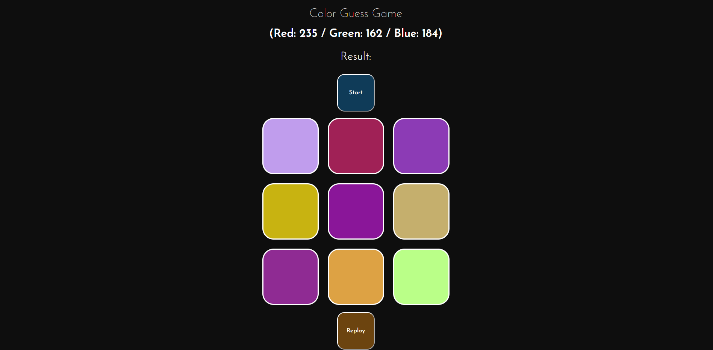

# 2021-2022 Bahar  / Web Programlama - Proje I

<h3 align="center" color="Darkblue">Batuhan Şimşek</h3>
<h4 align="center" color="Darkblue">20360859055</h4>

<h4 align="center" ><a href="http://colorguessgame.eu5.org" >Oynamak için tıklayın.</a></h6>

    Nasıl Oynanır?

        Start butonuyla rastgele bir RGB renk kodu üretilir,
        kutular birisi bu renk olmak üzere 9 farklı renkle renklendirilir.
        
        Kodu verilen renk 9 renk arasından tahmin edilmeye çalışılır.
        
        Tahmin yapıldıktan sonra ilgili kutuya tıklayarak seçimin doğru/yanlış olduğu kontrol edilir.
        
        Tekrar oynanmak istenirse Replay butonuyla yeniden oynanır. 
      
  
  

